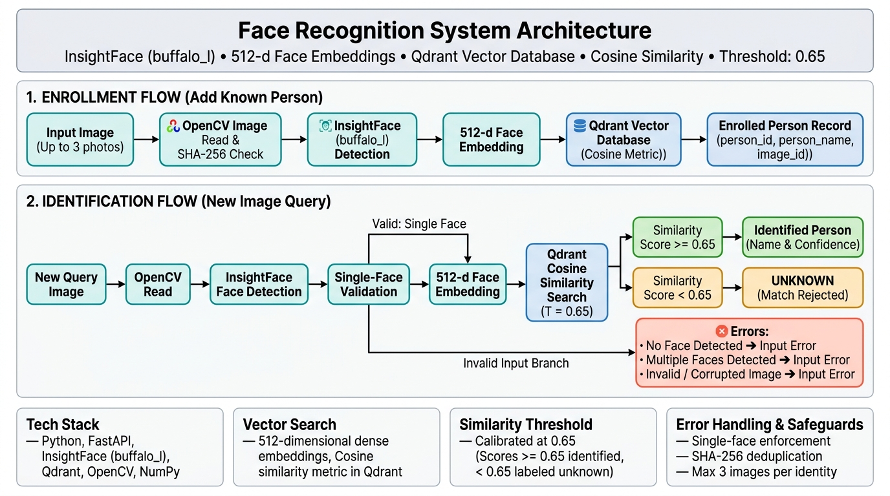

# Face Recognition Identification System

A face recognition and identification system that allows enrolling known individuals with multiple photos, generating 512-dimensional face embeddings, storing them in a Qdrant vector database, and identifying individuals from new images using cosine similarity and a calibrated rejection threshold.

Built for the **Code Nimbus Solutions AI/ML Intern** assignment.

---

## Architecture & Pipeline

```text
Input Image -> Face Detection -> 512-d Face Embedding -> Qdrant Similarity Search -> Best Match -> Similarity Threshold (0.65) -> Known / Unknown
```



---

## Features

- **Multi-Image Enrollment:** Enroll up to 3 distinct photos per person to capture variations in facial angle, lighting, and expression.
- **512-Dimensional Deep Embeddings:** Extracts dense facial feature vectors using InsightFace (`buffalo_l`).
- **Cloud Vector Database (Qdrant):** Fast vector indexing and cosine distance similarity search with payload-based metadata.
- **Calibrated Unknown Rejection:** Prevents assigning false identities to unknown individuals by enforcing a cosine similarity cutoff (`Threshold = 0.65`).
- **Single-Face Input Guard:** Rejects images containing multiple faces or no faces to avoid misattribution.
- **Duplicate Image Detection:** Computes SHA-256 hashes of input images to prevent inserting duplicate vectors into the collection.
- **Identity Collision Protection:** Prevents cross-enrolling the same face under conflicting names.
- **RESTful API & Web UI:** Built with FastAPI on the backend and an interactive camera-enabled React frontend.

---

## Model & Face Embeddings

- **Detection & Recognition Pipeline:** [InsightFace](https://github.com/deepinsight/insightface) using the pretrained **`buffalo_l`** model pack.
- **Embedding Vector:** Generates a normalized **512-dimensional numerical vector** representing unique facial landmark patterns and structures.
- **Comparison:** Instead of pixel-by-pixel comparisons, query face embeddings are compared against enrolled embeddings in multidimensional vector space.

---

## Similarity Matching & Vector Database

The system uses **Qdrant** as the vector search engine:

1. **Storage:** Each enrolled image's 512-d embedding is stored as a point in Qdrant with associated payload metadata (`person_id`, `person_name`, `image_id`).
2. **Metric:** **Cosine Similarity** ($\text{Cosine Distance} = 1 - \text{Cosine Similarity}$).
3. **Querying:** When a new query image is received, the system extracts its embedding and queries Qdrant for the top candidate matches.
4. **Candidate Selection:** Groups match scores by `person_id` and takes the maximum score per identity to evaluate against the threshold.

---

## Unknown Rejection & Threshold Selection

In vector databases, a nearest-neighbor query will **always** return a closest point—even if the person is a complete stranger. Without a cutoff threshold, every unknown visitor would be falsely matched to whoever looks least different.

### Threshold Calibration:
- **Initial Test (`0.70`):** While zero unknown faces were accepted, genuine enrolled faces with slight angle or lighting variations were falsely rejected (e.g., Cristiano Ronaldo scored `0.6550`, Donald Trump scored `0.6942`, Piyush Bansal scored `0.6644`, Yann LeCun scored `0.6929`).
- **Selected Threshold (`0.65`):** Lowering the threshold to `0.65` correctly admitted genuine candidates while still cleanly rejecting all unknown candidates (the highest unknown candidate scored `0.4219`).

```text
If Similarity Score >= 0.65  ->  Identified Person (Name + Score)
If Similarity Score < 0.65   ->  Unknown Person
```

---

## Evaluation Summary

The system was evaluated on a dedicated 45-image evaluation dataset (`data/evaluation/`) completely isolated from enrollment data.

| Metric | Result | Description |
|---|---:|---|
| **Total Evaluation Images** | **45** | 22 Known + 23 Unknown |
| **Known-Person Accuracy** | **95.45%** | 21 / 22 correctly identified |
| **False Rejection Rate (FRR)** | **4.55%** | 1 / 22 (`parth4.jpeg` scored `0.6218`) |
| **Unknown Rejection Rate** | **95.65%** | 22 / 23 correctly rejected as `unknown` |
| **False Acceptance Rate (FAR)** | **0.00%** | 0 / 23 unknown accepted as known |
| **Input Errors** | **1** | `ryan2.jpeg` (Multiple faces detected) |

> **Full Report:** For individual image scores, per-identity test logs, and failure case breakdowns, see the **[Detailed Evaluation Document](docs/EVALUATION.md)**.

---

## Input Validation & Failure Handling

The system catches and returns explicit status responses for invalid inputs:

- **No Face Detected:** Returns status `error` with `"No face detected."`
- **Multiple Faces Detected:** Returns status `multiple` with `"Multiple faces detected."`
- **Unreadable / Corrupted Image:** Returns status `error` with `"Could not read image."`
- **Duplicate Image:** Returns status `skipped` with `"Image already exists."`

---

## Project Structure

```text
CODE_NIMUBS/
├── app/
│   ├── config/
│   │   └── settings.py           # Pydantic settings & environment variables
│   ├── service/
│   │   ├── enrollment_service.py # Enrollment logic, deduplication & consistency
│   │   └── identification_service.py # Detection, search & threshold matching
│   ├── vectorstore/
│   │   └── vector_store.py       # Qdrant client, collections & queries
│   ├── detect.py                 # Standalone face detection helper
│   ├── logging_utils.py          # Formatted logging to app.log
│   ├── main.py                   # FastAPI application & route definitions
│   └── similarity.py             # Cosine similarity calculations
├── data/
│   ├── enrolled/                 # Enrolled identity photo folders
│   └── evaluation/               # Held-out 45 evaluation images
├── docs/
│   └── EVALUATION.md             # In-depth technical evaluation document
├── frontend/                     # React + Vite web application
│   ├── src/                      # UI components (camera, upload, results)
│   ├── package.json
│   └── vite.config.js
├── tests/
│   ├── test_enrollment.py        # Automated batch enrollment test script
│   ├── test_evaluation.py        # Complete 45-image evaluation runner
│   └── test_qdrant_integrity.py  # Checks database integrity & person_ids
├── architecture_diagram.png      # Complete architecture flowchart
├── requirements.txt              # Python dependencies
└── README.md                     # Project documentation
```

---

## Tech Stack

- **Backend Framework:** Python 3.10+, FastAPI, Uvicorn
- **AI / Computer Vision:** InsightFace (`buffalo_l`), ONNX Runtime, OpenCV, NumPy
- **Vector Database:** Qdrant (Cloud / Local) with Cosine metric
- **Configuration & Validation:** Pydantic Settings
- **Frontend (Optional):** React 19, Vite, Lucide Icons

---

## Setup & Installation

### 1. Clone the Repository
```bash
git clone https://github.com/hdRutvik114/face-recognition-identification-system.git
cd face-recognition-identification-system
```

### 2. Set Up Python Virtual Environment
```bash
# Windows (PowerShell)
python -m venv .venv
.venv\Scripts\activate

# macOS / Linux
python3 -m venv .venv
source .venv/bin/activate
```

### 3. Install Dependencies
```bash
pip install -r requirements.txt
```

### 4. Configure Environment Variables
Create a `.env` file in the project root:
```env
QDRANT_URL=https://your-qdrant-instance.cloud.qdrant.io:6333
QDRANT_API_KEY=your_qdrant_api_key_here
QDRANT_COLLECTION_NAME=face_embeddings_2
EMBEDDING_MODEL_NAME=buffalo_l
EMBEDDING_VECTOR_SIZE=512
```

---

## Running the Application

### 1. Start the FastAPI Backend
```bash
uvicorn app.main:app --reload
```
The server will start at `http://127.0.0.1:8000`.
- **Interactive Swagger Docs:** `http://127.0.0.1:8000/docs`
- **Health Check:** `http://127.0.0.1:8000/`

## Qdrant Configuration

This project uses Qdrant Cloud for storing and searching face embeddings.

For evaluation/testing purposes, the Qdrant credentials used by the project
have been provided separately with the submission.

Set the following environment variables before running the application:

QDRANT_URL=<provided credential>
QDRANT_API_KEY=<provided credential>
QDRANT_COLLECTION_NAME=face_embeddings

The repository does not contain the credentials directly to avoid exposing
API keys publicly.
### 2. Start the Frontend (Optional)
```bash
cd frontend
npm install
npm run dev
```
Open `http://localhost:5173` in your browser.

---

## API Usage & Endpoints

### 1. Health Check
* **Endpoint:** `GET /`
* **Response:**
  ```json
  {
    "message": "Face Recognition API is running"
  }
  ```

---

### 2. Enroll a Person
Upload 1 to 3 images to register or update an individual's identity.

* **Endpoint:** `POST /enroll`
* **Content-Type:** `multipart/form-data`
* **Form Fields:**
  * `name` (string, required): Full name of the person.
  * `images` (files, required): 1 to 3 image files (`.jpeg`, `.png`, `.jpg`).

#### Example `curl` Request:
```bash
curl -X POST "http://127.0.0.1:8000/enroll" \
  -F "name=Sundar Pichai" \
  -F "images=@data/enrolled/sundar_pichai/sundar1.jpeg" \
  -F "images=@data/enrolled/sundar_pichai/sundar2.jpeg" \
  -F "images=@data/enrolled/sundar_pichai/sundar3.jpeg"
```

#### Example Successful Response:
```json
{
  "person_id": "4d7e8b9a-1c2d-5e3f-8a9b-0c1d2e3f4a5b",
  "person_name": "Sundar Pichai",
  "enrolled_count": 3,
  "skipped_count": 0,
  "rejected_count": 0,
  "details": [
    {
      "image": "sundar1.jpeg",
      "status": "enrolled",
      "reason": "Successfully enrolled"
    },
    {
      "image": "sundar2.jpeg",
      "status": "enrolled",
      "reason": "Successfully enrolled"
    },
    {
      "image": "sundar3.jpeg",
      "status": "enrolled",
      "reason": "Successfully enrolled"
    }
  ],
  "message": "Enrollment completed."
}
```

---

### 3. Identify a Person
Submit a single image to recognize whether the person is enrolled.

* **Endpoint:** `POST /identify`
* **Content-Type:** `multipart/form-data`
* **Form Fields:**
  * `image` (file, required): Target image file.

#### Example `curl` Request:
```bash
curl -X POST "http://127.0.0.1:8000/identify" \
  -F "image=@data/evaluation/alakh4.jpeg"
```

#### Response Cases:

**Case A: Known / Identified Person (`Score >= 0.65`)**
```json
{
  "status": "identified",
  "person_id": "8a3e9c1d-...",
  "person_name": "Alakh Pandey",
  "score": 0.7076,
  "message": "Person identified successfully."
}
```

**Case B: Unknown Person (`Score < 0.65`)**
```json
{
  "status": "unknown",
  "person_id": null,
  "person_name": null,
  "score": 0.4219,
  "message": "Unknown person."
}
```

**Case C: Multiple Faces Detected**
```json
{
  "status": "multiple",
  "message": "Multiple faces detected."
}
```

**Case D: No Face Detected**
```json
{
  "status": "error",
  "message": "No face detected."
}
```

---

## Running Tests & Evaluation

### Run Batch Enrollment Test:
```bash
python tests/test_enrollment.py
```

### Run Accuracy & Threshold Evaluation:
```bash
python tests/test_evaluation.py
```

### Check Qdrant Consistency & Constraints:
```bash
python tests/test_qdrant_integrity.py
```

---

## Limitations & Future Improvements

### Current Limitations:
- **Single Subject Identification:** Input images with multiple faces are rejected rather than simultaneously bounding and identifying each individual.
- **Controlled Evaluation Dataset:** Tested on a 45-image curated dataset; real-world performance will vary across extreme demographic diversity, heavy motion blur, or CCTV angles.
- **Static Threshold:** A single global threshold of `0.65` is applied across all image resolutions and angles.

### Future Roadmap:
- [ ] **Multi-Face Recognition:** Return bounding boxes and identifications for all individuals in a group photo simultaneously.
- [ ] **Image Quality Assessment:** Pre-score image sharpness and illumination before inference to prompt users to retake blurry photos.
- [ ] **Adaptive Thresholding:** Adjust cosine similarity cutoffs dynamically based on detected face yaw/pitch angles.
- [ ] **Liveness Detection:** Integrate anti-spoofing checks (blink detection / texture analysis) to prevent static photo presentation attacks.
