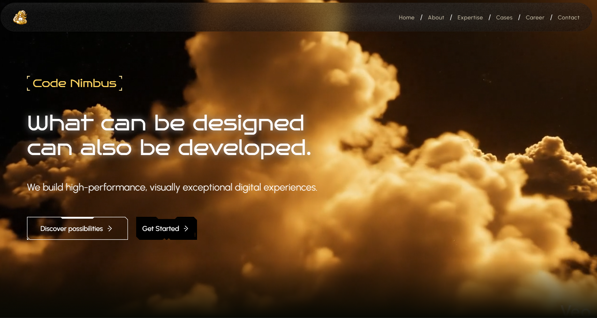

# Frontend Task: Face Recognition Identification System

### Code Nimbus Solutions — AI/ML Intern Assignment

You are implementing **ONLY the frontend** for an existing face-recognition backend.

The backend is already built and working. Your responsibility is to inspect it, understand its **actual contract**, and build a polished React frontend around that contract.

---

# 0. NON-NEGOTIABLE RULES

These rules apply throughout the entire task.

## Rule 1 — Backend is FROZEN

Do **not** modify, refactor, rename, clean up, or otherwise change any backend file.

This includes, but is not limited to:

* enrollment service
* identification service
* vector store / Qdrant logic
* InsightFace logic
* models
* schemas
* API routes
* thresholds
* validation logic
* exception handling
* response formats
* database/vector-store behavior

The backend is **read-only** for this task.

If you believe a backend change is necessary:

1. STOP.
2. Explain exactly why it appears necessary.
3. Identify the specific backend file/function involved.
4. Explain the frontend alternative, if one exists.
5. Ask for explicit approval.

Do not make the backend change yourself.

---

## Rule 2 — The backend code is the source of truth

Do not assume that the backend behaves according to this prompt.

The following information is only an **initial hypothesis** and MUST be verified against the actual backend code.

If the actual implementation differs from the assumptions below:

> **Trust the backend code, not this prompt.**

Clearly report every discrepancy before implementation.

Do not invent:

* fields
* endpoints
* status values
* HTTP status codes
* error messages
* validation rules
* response properties
* request parameter names
* threshold values
* enrollment limits
* failure cases

The frontend must consume the backend **exactly as it exists**.

---

## Rule 3 — NO implementation before approval

Do not:

* create frontend files
* modify frontend files
* install packages
* run `npm create`
* scaffold a project
* write React components
* write CSS
* write API code

until I explicitly approve the plan.

You must complete Steps 1–6 below and then STOP.

Your response at that point must end with a clear request for approval.

---

## Rule 4 — Frontend only

This task authorizes changes only to the frontend.

Do not modify:

* Python files
* FastAPI routes
* Qdrant collections
* embeddings
* similarity calculations
* thresholds
* database/vector-store configuration
* backend API contracts

---

# 1. INSPECT THE EXISTING BACKEND

Before proposing frontend implementation, inspect the actual backend source code.

Determine the real implementation of:

### Root endpoint

Verify:

* HTTP method
* path
* response body
* HTTP status code

### Enrollment endpoint

Determine:

* exact route
* HTTP method
* request field names
* whether `multipart/form-data` is used
* exact file field name(s)
* name/person field name
* maximum number of images
* face validation rules
* duplicate detection behavior
* duplicate detection mechanism
* enrollment limits
* exact success response
* exact error responses
* HTTP status codes
* whether partial enrollment is possible
* whether rejected images are returned individually
* whether skipped/rejected image information is returned
* exact backend error messages

### Identification endpoint

Determine:

* exact route
* HTTP method
* request field name
* accepted file format
* face validation behavior
* exact similarity-search behavior
* top-K behavior, if applicable
* threshold
* where the threshold is defined
* exact success response
* exact unknown response
* exact rejection/error responses
* HTTP status codes
* error message format

### Important

Do not infer response shapes from documentation, comments, README files, or this prompt if the actual route implementation differs.

Inspect the actual route/service/schema code.

---


# 1A. Backend Contract Report

Present the findings in a concise table.

Example format:

| Area                | Actual implementation | Prompt assumption | Match? |
| ------------------- | --------------------- | ----------------- | ------ |
| `/enroll` request   | ...                   | ...               | ✅/❌    |
| `/enroll` success   | ...                   | ...               | ✅/❌    |
| `/identify` request | ...                   | ...               | ✅/❌    |
| `/identify` success | ...                   | ...               | ✅/❌    |
| Unknown response    | ...                   | ...               | ✅/❌    |
| Threshold           | ...                   | 0.65              | ✅/❌    |
| Multiple-face error | ...                   | ...               | ✅/❌    |

If something cannot be confirmed from the code, explicitly say:

> **Not confirmed from the inspected backend.**

Do not fill gaps with assumptions.

---

# 1B. Backend Error Matrix

Create an exact error matrix from the backend.

| Scenario                   | HTTP status | Actual response | Frontend interpretation |
| -------------------------- | ----------: | --------------- | ----------------------- |
| No face                    |         ... | ...             | ...                     |
| Multiple faces             |         ... | ...             | ...                     |
| Invalid/unreadable image   |         ... | ...             | ...                     |
| Duplicate enrollment image |         ... | ...             | ...                     |
| Enrollment limit reached   |         ... | ...             | ...                     |
| Unknown person             |         ... | ...             | ...                     |
| Other validation error     |         ... | ...             | ...                     |

Only include cases actually found in the backend.

Do not invent frontend states for errors that do not exist.

---

# 2. INSPECT THE EXISTING FRONTEND PROJECT

Inspect the current frontend project before proposing changes.

Determine:

* framework/version
* Vite version
* React version
* JavaScript vs TypeScript
* current `package.json`
* installed dependencies
* current directory structure
* existing components
* existing pages
* existing CSS
* existing Tailwind installation
* Tailwind version
* PostCSS setup, if applicable
* Vite configuration
* existing environment-variable setup
* existing API/service layer
* whether routing already exists
* whether any UI is already implemented

Do not replace existing setup blindly.

Reuse useful existing code where appropriate.

---

# 2A. Tailwind CSS v4 Verification

The project is expected to use Tailwind CSS v4, but do NOT assume the setup.

Inspect the actual installed version and configuration first.

If Tailwind v4 is installed:

* follow the current Tailwind v4 CSS-based configuration approach
* use `@theme` where appropriate
* do not introduce a Tailwind v3-style `tailwind.config.js` workflow unless the existing project genuinely requires it

If the installed version/configuration differs from the expectation:

* report it
* explain what the frontend plan will use
* do not silently migrate the project before approval

---

# 2B. Frontend State Report

Report:

### Existing stack

* React:
* Vite:
* Tailwind:
* Axios:
* Other dependencies:

### Existing structure

Show only the relevant files/directories.

### Existing reusable code

Identify anything worth keeping.

### Required changes

Separate:

* files to modify
* files to create
* files that should remain untouched

---

# 3. INSPECT THE OFFICIAL CODE NIMBUS SOLUTIONS WEBSITE
link : https://codenimbussolutions.com/
Research the official Code Nimbus Solutions website.
if you want create animation like them use it (may be they are using reactbits,gsap,maybe some other )
Do not copy its layout, text, assets, branding, or exact page structure.

The purpose is only to understand its **visual language**.

Extract concrete design observations.

## Design Token Summary

Provide approximately:

### Colors

| Token          | Approximate value | Usage |
| -------------- | ----------------- | ----- |
| Primary        | `#...`            | ...   |
| Accent         | `#...`            | ...   |
| Background     | `#...`            | ...   |
| Surface/card   | `#...`            | ...   |
| Primary text   | `#...`            | ...   |
| Secondary text | `#...`            | ...   |
| Border         | `#...`            | ...   |

### Typography

Identify:

* font family
* heading weight
* body weight
* button weight
* approximate heading sizes
* approximate body size
* line-height characteristics

### Spacing

Identify approximate:

* page horizontal padding
* section spacing
* card padding
* grid gaps
* button spacing

### Components

Identify:

* corner radius style
* card treatment
* button shape
* CTA treatment
* navigation style
* border/shadow usage

### Motion

Identify any recurring:

* hover transitions
* entrance animations
* image movement
* button interactions
* scroll effects

Do not reproduce the website.

Extract the **design language**, then create an original interface.

---

# 4. PROPOSE THE VISUAL DIRECTION

Based on the extracted design tokens, propose an original interface for the face-recognition product.

The interface should feel like a **real AI product**, not a college dashboard.

Do not make it look like an official Code Nimbus Solutions product.

Do not reuse:

* Code Nimbus copy
* Code Nimbus images
* Code Nimbus layout
* Code Nimbus branding assets
but make ui and the all the stuffs must be like Code Nimbus

## Proposed structure

### Navbar

Include:

* product name
* Enroll navigation
* Identify navigation
* optional Evaluation / About section if it adds meaningful value

### Hero

Create original copy.

The hero should communicate:

* face enrollment
* identity matching
* unknown-person rejection

Keep the headline concise.

Avoid generic AI buzzword-heavy copy.

### Main workflows

Use the two core workflows as the visual focus:

**Enroll**

and

**Identify**

The face/image itself should remain visually important.

Avoid excessive decorative elements.

---

# 4A. UX Direction

The application should include:

* responsive desktop-first layout
* mobile-friendly behavior
* clear visual hierarchy
* strong typography
* consistent spacing
* subtle animation
* accessible controls
* disabled states during requests
* loading indicators
* inline error messages
* keyboard-accessible controls
* visible focus states
* clear success/unknown/rejected states
* image previews
* remove controls
* drag-and-drop only if it can be implemented cleanly without unnecessary dependencies

Do not use `alert()` for normal application feedback.

Do not add unnecessary libraries just for visual effects.

---

# 5. PROPOSE THE FRONTEND FILE STRUCTURE

Design a small structure appropriate for this application's actual complexity.

Do NOT create dozens of files.

The structure should be simple enough that I can explain every file in an interview.

A possible direction is:

```text
src/
├── components/
├── pages/
├── services/
├── App.jsx
├── main.jsx
└── index.css
```

However, this is only an example.

Determine the actual structure based on the existing project.

For every proposed file, provide one sentence explaining its purpose.

Example:

```text
src/services/api.js
```

> Central Axios instance and API functions; reads the API base URL from `VITE_API_BASE_URL`.

Potential component responsibilities may include:

* Navbar
* Hero
* ImageUploader
* ImagePreview
* EnrollForm
* EnrollmentResult
* IdentifyForm
* IdentificationResult
* LoadingIndicator
* ErrorMessage

Only create components that genuinely improve clarity or reuse.

Avoid componentizing every small `<div>`.

---

# 5A. State Design

Explain the minimum React state required.

For example, determine whether the application needs state for:

### Enrollment

* name
* selected images
* previews
* request/loading state
* success result
* backend error
* validation state

### Identification

* selected image
* preview
* request/loading state
* result
* backend error

Use the actual backend response shape to determine result state.

Do not invent fields.

---

# 6. PROPOSE THE API INTEGRATION PLAN

The frontend must use a single configurable API base URL.

Environment variable:

```text
VITE_API_BASE_URL
```

There must be one central place responsible for reading it.

For example:

```text
src/services/api.js
```

Do not hardcode:

```text
http://127.0.0.1:8000
```

or any other backend URL throughout components.

---

# 6A. API Service Responsibilities

Explain how the API service will expose the actual backend operations.

For example, conceptually:

```text
enrollPerson(...)
identifyPerson(...)
```

But the exact function arguments and request structure must be derived from the inspected backend.

The API service should:

* use the configured base URL
* use Axios
* construct the correct request format
* send the correct field names
* return backend data
* preserve meaningful backend errors
* avoid changing backend semantics

Do not create frontend response fields that do not exist in the backend.

---

# 6B. Loading/Error Flow

Explain the lifecycle for each workflow.

## Enrollment

```text
User selects images
        ↓
Frontend validates basic UI constraints
        ↓
User clicks Enroll
        ↓
Button disabled
        ↓
Loading indicator shown
        ↓
API request
        ↓
Success → enrollment result
        ↓
Backend error → exact meaningful error shown
        ↓
Loading ends
```

## Identification

```text
User selects image
        ↓
Preview shown
        ↓
User clicks Identify
        ↓
Button disabled
        ↓
Loading indicator shown
        ↓
API request
        ↓
identified → name + score
unknown → unknown + score/threshold explanation
rejected → actual backend rejection message
        ↓
Loading ends
```

The actual implementation must follow the backend's real response/error contract.

---

# 6C. Identification Result Semantics

The UI should distinguish the actual backend outcomes.

## Identified

Show, where provided by the backend:

* person name
* similarity score
* success message

## Unknown

Show:

* explicit `unknown` state
* score, if returned
* explanation that the match did not satisfy the configured threshold

The threshold displayed in the UI must come from the actual backend configuration/contract.

Do not hardcode `0.65` simply because the prompt says so.

If the backend does not expose the threshold dynamically, determine whether displaying a known configured value is safe based on the inspected code.

## Rejected

For cases such as:

* no face
* multiple faces
* unreadable image

show the **actual backend message**, appropriately formatted for the UI.

Do not replace every backend error with:

> "Something went wrong."

Do not invent rejection categories that the backend does not provide.

---

# 6D. Enrollment Result Semantics

The enrollment UI must reflect what the backend actually returns.

If the backend returns:

* number of enrolled images → display it
* rejected images → display them
* skipped images → display them
* messages → display them appropriately

If the backend does NOT return rejected/skipped-image information:

> Do not create fake rejected/skipped-image UI.

Instead, show only the information that actually exists in the backend response.

---

# 6E. Backend Modification Decision

State explicitly:

### Backend change required: YES / NO

If **NO**:

> The frontend can implement the requested workflows using the existing backend contract without modifying backend logic.

If **YES**:

Do not make the change.

Instead provide:

* exact reason
* exact backend file
* exact issue
* frontend alternatives considered

Then stop and ask for approval.

---

# 7. IMPLEMENTATION GATE

After completing Steps 1–6:

## STOP.

Do not write implementation code.

Do not create files.

Do not install dependencies.

Do not scaffold anything.

Do not modify anything.

Wait for my explicit approval.

Acceptable approval examples:

> "Approved. Start implementation."

or

> "Plan approved. Begin Step 7."

Only after explicit approval may implementation begin.

---

# 8. IMPLEMENTATION AFTER APPROVAL

Once approved, implement incrementally.

Do NOT generate the entire application blindly in one pass.

Use this sequence:

### Phase 1 — Foundation

* existing project setup
* environment configuration
* Tailwind styling foundation
* API service
* global styles

### Phase 2 — Layout

* Navbar
* Hero
* page/workflow structure

### Phase 3 — Enrollment

* name input
* image selection
* previews
* remove controls
* upload limit based on actual backend contract
* loading state
* API integration
* result/error state

### Phase 4 — Identification

* image upload
* preview
* identify action
* loading state
* API integration
* identified state
* unknown state
* rejected state

### Phase 5 — Polish

* responsive behavior
* transitions
* hover states
* focus states
* accessibility
* spacing
* visual consistency
* empty states
* disabled states

After each phase:

1. explain what changed
2. identify files changed
3. explain why
4. run/check the relevant frontend behavior
5. identify any issue before proceeding

Do not modify backend code.

---

# 9. ACCEPTANCE CRITERIA

The finished frontend should support this demo flow.

## Demo 1 — Application launch

Open the application and see:

* polished hero
* clear product identity
* navigation
* Enroll workflow
* Identify workflow

---

## Demo 2 — Enroll a person

Enter a person's name.

Select up to the backend-supported number of images.

See:

* image previews
* remove controls
* clear Enroll button
* loading state during request
* actual backend result

---

## Demo 3 — Identify enrolled person

Upload a new image of an enrolled person.

Click Identify.

Show:

* identified state
* person name
* similarity score
* backend success information where appropriate

---

## Demo 4 — Unknown person

Upload an image of a person who is not enrolled.

Show:

* clear Unknown state
* similarity score if returned
* explanation that the score did not satisfy the configured threshold

Do not present Unknown as a frontend/network error.

---

## Demo 5 — Multiple-face image

Upload an image containing multiple faces.

Show:

* proper rejected/error state
* actual backend message or accurately formatted version of it
* no crash
* no generic unexplained error

---

## Demo 6 — No-face image

Upload an image containing no detectable face.

Show the actual backend rejection/error state.
uing toast or whatever

---

# 10. QUALITY BAR

The final interface should feel like a small production product.

Prioritize this :

### Visual

* excellent spacing
* strong typography
* restrained color usage
* clear hierarchy
* consistent radius/borders
* subtle motion
* professional cards
* image/result as the visual focus
 
### UX

* obvious actions
* meaningful feedback
* no unnecessary clicks
* disabled request states
* loading indicators
* useful error messages
* responsive layout
* accessible controls

### Code

* small number of understandable files
* clear component responsibilities
* no unnecessary abstraction
* no unnecessary dependencies
* no duplicated API configuration
* no hardcoded API URL
* no backend modifications
* no invented API behavior

### Interview-readiness

I should be able to explain:

1. why the frontend is structured this way
2. how the API integration works
3. how environment configuration works
4. how enrollment state is managed
5. how identification results are classified
6. how backend errors reach the UI
7. why the UI does not modify backend behavior
8. why the design choices were made

---

# 11. FINAL RULE

When there is a conflict between:

* this prompt
* assumptions in this prompt
* comments/documentation
* typical FastAPI behavior
* typical face-recognition behavior

and the **actual backend implementation**:

> **The actual backend implementation wins.**

Never silently compensate for a backend mismatch.

Report it first.

Never modify the backend unless I explicitly approve the specific change.

---
### IMPORTANT — Keep the frontend focused and original

Do **not** add unnecessary UI, features, sections, animations, decorations, or dependencies that are not required for this application.

Do not make it look like a generic AI-generated dashboard or a generic "Claude/ChatGPT-style" interface.

Avoid:

* excessive gradients
* random glowing effects
* excessive purple/blue AI aesthetics
* unnecessary glassmorphism
* excessive rounded cards
* decorative blobs or floating shapes
* unnecessary icons
* fake statistics or metrics
* unnecessary dashboards
* generic AI slogans
* excessive animations
* unnecessary sections
* unnecessary dependencies

Use the Code Nimbus design research only as a **visual language**, not as something to copy.

Keep the color palette **intentional and restrained**. Do not introduce random colors just to make the UI look "modern."

Every visual element should have a purpose related to:

* face enrollment
* image preview
* face identification
* similarity result
* unknown-person handling
* error/rejection feedback
* navigation

The goal is a **clean, professional, original face-recognition product interface** that feels designed by a developer, not generated from a generic AI dashboard template.

When deciding whether to add something, prefer:

> **Simple + purposeful + polished**

over:

> **More features + more decoration + more visual effects**


# REQUIRED FIRST RESPONSE

Your first response to this task must contain ONLY:

1. **Step 1 — Backend inspection**
2. **Step 2 — Existing frontend inspection**
3. **Step 3 — Code Nimbus design-token inspection**
4. **Step 4 — Proposed visual direction**
5. **Step 5 — Proposed frontend structure**
6. **Step 6 — API integration plan**
7. **Backend change required: YES/NO**
8. **Explicit approval request**

Then stop.

**Do not implement anything until I approve the plan.**



Task: 
I now want to add a production-style camera-based enrollment flow to the existing frontend.

IMPORTANT:
Do NOT redesign or replace the existing website.
Do NOT break the existing Enroll or Identify functionality.
First inspect the existing frontend, backend API integration, components, styling, and project structure before making changes.

The goal is to add a polished "Camera Enrollment" experience that feels like a real production face-recognition product, consistent with the visual language and quality of the existing Code Nimbus-inspired frontend.

==================================================
FEATURE: CAMERA-BASED FACE ENROLLMENT
==================================================

Create a dedicated camera enrollment page/flow.

The user should enter the person's name and then use their device camera to capture exactly 3 enrollment images.

The flow should feel guided and simple rather than like a raw webcam preview.

Example flow:

1. Enter person's name
2. Start camera
3. Capture image 1
4. Capture image 2
5. Capture image 3
6. Review the three captured images
7. Submit all three images to the existing `/enroll` API
8. Display the actual backend enrollment result

==================================================
CAMERA EXPERIENCE
==================================================

Use the browser's native camera access through:

navigator.mediaDevices.getUserMedia()

Request the front-facing/user camera when available.

Before capturing:

Show a polished camera frame with:

- live camera preview
- face-positioning guide
- short instruction
- capture button
- current capture progress

Example:

"Position your face inside the frame"

"Capture 1 of 3"

Do NOT implement complicated facial tracking or liveness detection in the frontend.

The backend remains responsible for actual face detection and validation.

==================================================
3 CAPTURE FLOW
==================================================

The three captures should introduce only SMALL variations.

Do NOT ask the user to make large movements.

Capture 1:
"Look straight at the camera"
Small neutral expression.

Capture 2:
"Give a small smile"
Only a slight natural smile.

Capture 3:
"Turn your face slightly"
Only a very small left/right variation.

The intention is to create slightly different representations of the same person while keeping the face clearly visible.

Do not ask the user to dramatically turn their head, close their eyes, move far away, etc.

After each capture:

- Freeze/show the captured image
- Show a thumbnail/progress indicator
- Allow the user to retake that specific image
- Continue to the next capture

The user should always know:

Capture 1 ✓
Capture 2 ✓
Capture 3 ○

==================================================
CAMERA UI
==================================================

Make the camera experience look like a production application.

Use:

- rounded camera container
- subtle border/glow
- face-positioning frame overlay
- clean typography
- clear capture button
- small progress indicator
- smooth transitions
- loading states
- helpful error messages

Do not make it look like a developer/debugging tool.

Avoid excessive animations, gradients, or decorative elements.

Keep it consistent with the existing Code Nimbus-inspired visual system already present in the application.

Use the existing Tailwind CSS v4 setup.

Do not introduce another styling framework.

==================================================
CAPTURE VALIDATION
==================================================

Frontend validation should only handle basic camera/capture concerns.

Handle:

- camera permission denied
- camera unavailable
- browser does not support camera access
- camera stream failure
- user stops camera
- capture failure

Do NOT attempt to determine whether the face is valid using frontend image processing.

The backend already performs:

- face detection
- no-face rejection
- multiple-face rejection
- embedding generation
- database enrollment

Therefore, use the backend as the source of truth.

==================================================
API INTEGRATION
==================================================

IMPORTANT:

Use the existing API service layer.

Do NOT create random fetch/axios calls scattered throughout components.

Inspect how the current frontend communicates with the backend and follow the existing architecture.

The existing backend endpoint is:

POST /enroll

It expects:

name
images[]

The backend currently accepts up to 3 images.

Send the three captured images as multipart/form-data.

The request should conceptually be:

FormData:
    name = person's name
    images = captured image 1
    images = captured image 2
    images = captured image 3

Do NOT send base64 strings if the existing API expects UploadFile/multipart files.

Use actual Blob/File objects generated from the captured canvas frames.

Set appropriate filenames for the captured images, for example:

camera_capture_1.jpg
camera_capture_2.jpg
camera_capture_3.jpg

Do not manually set the multipart Content-Type header if Axios/browser needs to generate the boundary automatically.

==================================================
BACKEND RESPONSE
==================================================

Do not invent response fields.

Inspect the existing `/enroll` implementation and use the actual response returned by the backend.

The current backend returns information such as:

- person_id
- person_name
- enrolled_count
- skipped_count
- rejected_count
- details
- message

Display the actual backend result in a polished result state.

For example:

Enrollment Complete

Rithvik

3 images enrolled

Then optionally show the per-image results:

Capture 1   ✓ Enrolled
Capture 2   ✓ Enrolled
Capture 3   ✓ Enrolled

If the backend rejects or skips an image, show the actual reason returned by the backend.

Do NOT replace backend errors with generic "success" messages.

==================================================
REVIEW BEFORE SUBMIT
==================================================

After the third capture:

Show a review step.

Display the three captured images as cards/thumbnails.

Example:

Your enrollment photos

[ Photo 1 ] [ Photo 2 ] [ Photo 3 ]

[ Retake ]      [ Submit Enrollment ]

Allow the user to retake an individual image before submitting.

Do not automatically submit immediately after capture 3.

The user should explicitly click the final enrollment button.

==================================================
LOADING STATE
==================================================

When submitting:

Disable the submit button.

Show:

"Enrolling face..."

Use a subtle loading indicator.

Prevent duplicate API submissions.

After the API responds, stop the camera stream.

==================================================
CAMERA CLEANUP
==================================================

This is important.

Stop all MediaStream tracks when:

- the component/page unmounts
- the user leaves the camera flow
- enrollment succeeds
- enrollment fails
- the user cancels camera enrollment

Do not leave the webcam running in the background.

==================================================
RESPONSIVE DESIGN
==================================================

The experience must work properly on:

- desktop
- laptop
- tablet
- mobile

On mobile, the camera preview should use the available viewport effectively.

Buttons should be large enough to use comfortably.

==================================================
PRODUCTION-QUALITY UX
==================================================

The experience should feel like a real product, not a demo.

Include:

- clear step progression
- meaningful empty states
- permission errors
- retry actions
- loading states
- success state
- backend rejection state
- camera cleanup
- accessible buttons
- keyboard-friendly controls where applicable

Keep the UI visually consistent with the existing website.

Do NOT over-engineer.

==================================================
IMPORTANT ARCHITECTURE RULE
==================================================

Before coding:

1. Inspect the current frontend structure.
2. Inspect the existing API service.
3. Inspect the current `/enroll` integration.
4. Inspect the existing design system/components.
5. Reuse existing components/styles wherever possible.
6. Identify exactly which files need to change.
7. Then implement the camera enrollment flow.

Do not modify the backend unless absolutely necessary.

The existing backend already supports:

POST /enroll

with:

name
images[]

The goal is to integrate the camera flow with the existing backend, not redesign the backend.

### Face Capture / Camera Interaction Reference

For the face-capture experience, use **Apple Face ID's face-positioning interaction** as the primary UX reference.

Study how a real face-capture system:

* guides the user to position their face
* uses a clear face-positioning frame
* keeps the face as the visual focus
* communicates whether the face is correctly positioned
* provides subtle capture/scanning feedback
* handles the transition from camera → captured image → result
* avoids unnecessary UI decoration

The goal is to make the experience feel like a **real computer-vision product**, not a generic AI website.

Do NOT copy Apple's branding, exact graphics, animations, or UI.

### Important

Do not add:

* random glowing face outlines
* neon scanning effects
* sci-fi HUD elements
* excessive corner brackets
* fake "AI scanning" animations
* unnecessary particles
* generic purple/blue AI gradients
* decorative 3D elements

The face and camera frame should do most of the visual work.

Use a **simple, purposeful face-positioning frame** with subtle feedback.

For example, the capture experience should communicate states such as:

**Position your face**

→ face detected / correctly positioned

→ **Capture**

→ captured image preview

→ **Identify**

The exact states and wording must still be compatible with what the existing backend actually supports.

Do not pretend the backend performs live face tracking or live quality analysis if it does not.

If the existing backend only accepts an uploaded image, build the camera/capture UI only if the browser-side implementation can be added without changing the backend contract. Otherwise, keep the experience focused on image upload and preview.

The final result should feel like a **real face-recognition application**, not "AI slop."

==================================================
FINAL USER FLOW
==================================================

The final experience should feel like:

Enroll Person
       ↓
Enter Name
       ↓
Start Camera
       ↓
"Look straight"
       ↓
Capture 1
       ↓
"Small smile"
       ↓
Capture 2
       ↓
"Slightly turn your face"
       ↓
Capture 3
       ↓
Review Photos
       ↓
Submit Enrollment
       ↓
POST /enroll
       ↓
Backend processes faces
       ↓
Show actual enrollment result

Keep the visual quality consistent with the existing Code Nimbus-inspired production frontend.

Do not add fake data.
Do not add fake face detection.
Do not add frontend liveness detection.
Do not change the existing backend API contract.
Do not break the existing Identify flow.

Before making major changes, explain briefly what files you plan to modify and why. Then implement the feature.